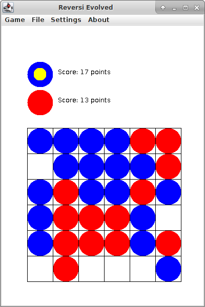

ENN-reversi
===========

ENN-reversi is an implementation of the board game [Reversi](https://en.wikipedia.org/wiki/Reversi).
The implementation comes with a pre-trained bot serving as a computer-opponent.
An example of the program is shown below:



A runnable JAR file can be found in the `bin/` folder.


Running the program
-------------------

To run ENN-reversi using the JAR file and pretrained network:
```bash
$ java -jar enn-reversi.jar
```


AI-enabled computer opponent
----------------------------

Evolutionary neural networks were used in self-play to randomly mutate a board valuation function.
Standard search with alpha-beta pruning is used to decide on which actions to take.
The bot can be retrained using the developer options:

```bash
$ java -jar enn-reversi.jar dev
```

This will add a developer entry to the top menu bar, from which the valuation function can be retrained.
